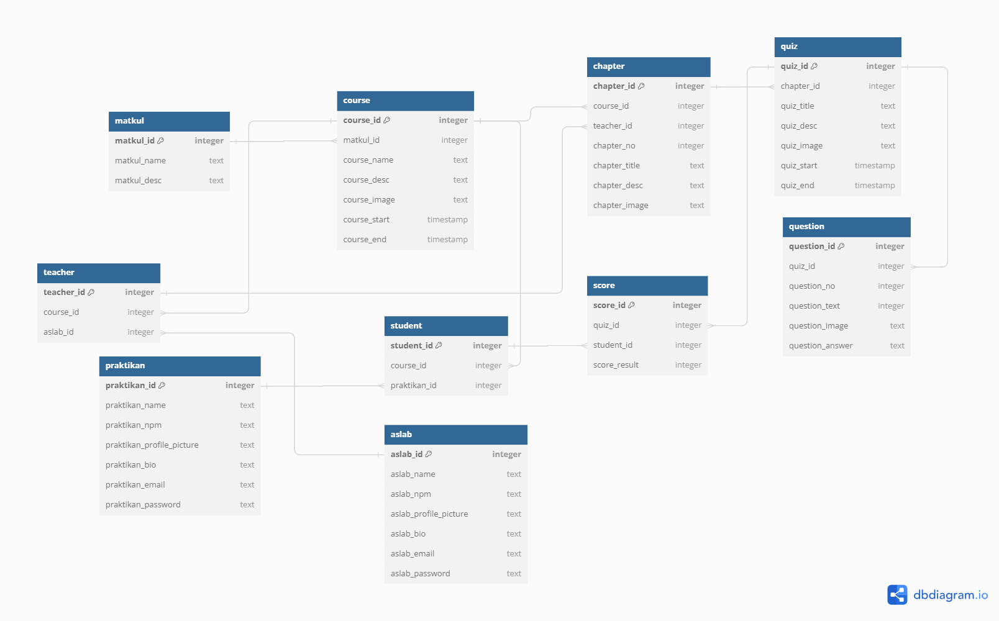

# Digital Laboratory Web (DigiWeb) Project

## Latar Belakang

Untuk saat ini, kegiatan praktikum yang diselenggarkan oleh Digital Laboratory masih membutuhkan jasa dari Website EMAS milik Universitas Indonesia dalam mengunggah soal serta materi praktikum. Web Digilab diciptakan agar kegiatan praktikum tidak sepenuhnya mengandalkan website EMAS lagi. Hal ini bertujuan agar tampilan EMAS praktikan diharapkan hanya berisikan course yang disediakan dosen saja, sedangkan course Asisten akan diunggah pada Web Digilab secara tersendiri.  Web Digilab juga merupakan salah satu wujud agar kegiatan praktikum Laboratory Digital dapat berkembangkan kedepannya dengan memanfaatkan Websitenya sendiri. 

## Deskripsi

Source Code Web Digilab akan dibagi menjadi 2 bagian, yakni program Front End dan program Back End. Framework React Js, CSS Tailwind, dan Spline adalah framework utama yang dimanfaatkan untuk mengembangkan bagian Front End, sedangkan framework Node Js adalah framework utama yang dimanfaatkan untuk mengembangkan bagian Back End. Selebihnya, database PostgreSQL dimanfaatkan sebagai  media DBMS untuk Web Digilab yang ingin dikembangkan. Karakteristik Relational dari PostgreSQL menyebabkan database yang dikelola dapat dinormalisasi sehingga mencegah terjadinya redundansi data. Hal tersebut memberikan performa database yang lebih baik serta efisien apabila ingin melakukan operasi CRUD (Create, Read, Update, Delete) oleh Clien.

## Database UML



## Database ERD

### Entity to Attribute Relationship


### Entity to Entity Relationship


## Cara Penggunaan

- Download or clone the repository  
```git clone https://github.com/SistemBasisData2024/WebDigilab```

- Install dependencies    
```npm install```

- Run the backend  
```npm run start```

- Run the frontend  
```npm run dev```

## Preview Web

1. **Login page:** Halaman ini digunakan bagi pengguna yang ingin masuk ke WebDigilab dengan akun yang dimilikinya. Pengguna dapat masuk sebagai Asisten atau Praktikan


2. **Register page:** Halaman ini digunakan bagi pengguna yang ingin masuk ke WebDigilab dengan membuat akun baru.


3. **Home page:** Halaman ini merupakan halaman beranda yang menyambut pengguna yang masuk. Pada halaman ini pengguna dapat pergi ke halaman Courses bagi Praktikan dan Edit Courses khusus bagi Asisten.


4. **Courses page:** Halaman ini merupakan halaman bagi pengguna untuk menelusuri berbagai course yang dapat diakses olehnya. Pengguna dapat memilih sebuah course untuk pergi ke halaman course tersebut.


5. **Course page:** Halaman ini merupakan halaman bagi pengguna untuk membaca modul pada course yang telah dipilihnya.


6. **Edit Courses page:** Halaman ini merupakan halaman bagi Asisten untuk mengedit course, menambahkan course, dan menambahkan chapter yang ada pada WebDigilab.


7. **Edit Course form:** Form ini digunakan oleh Asisten untuk mengedit course yang ada. 


8. **Add Course form:** Form ini digunakan oleh Asisten untuk menambahkan sebuah course baru pada WebDigilab.


9.  **Add Chapter form:** Form ini digunakan oleh Asisten untuk menambahkan sebuah chapter baru pada WebDigilab.


10. **Navigation:** Fitur ini berguna untuk memudahkan pengguna berpindah-pindah halaman dari Home, Courses, dan Edit Courses.


11. **Account Settings:** Halaman ini berguna untuk pengguna mengedit profile dari akunnya.


